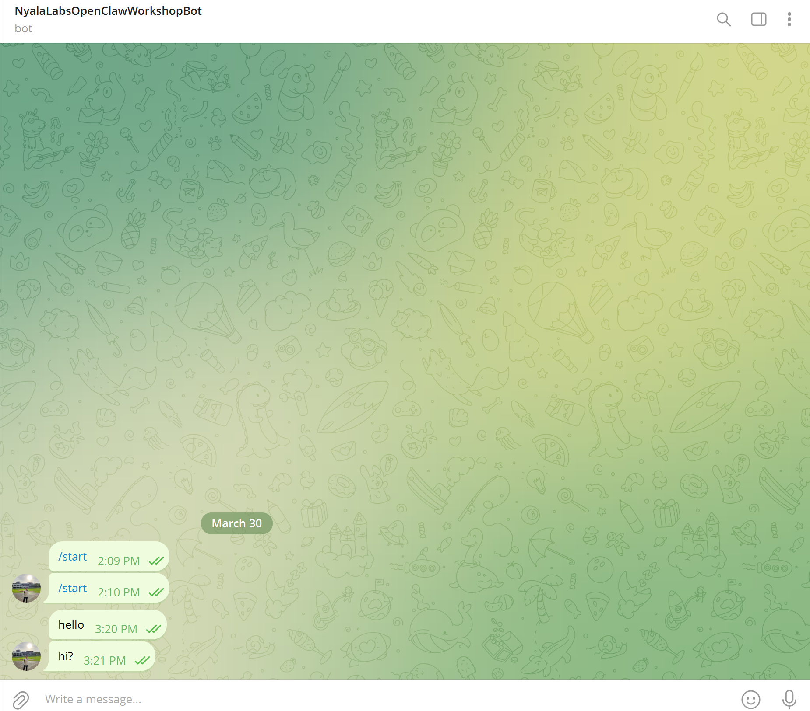
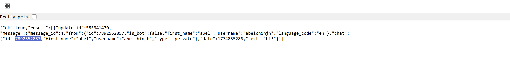

# OpenClaw Workshop — Student Quick Start

A **2-hour** hands-on session for **OpenClaw**, an autonomous AI agent framework. You will set up the Docker-based sandbox and run **one** skill (`local_file_io`) during the workshop. The rest of the repo is **production-shaped** so you can study it afterward.

## Prerequisites

- Docker and Docker Compose v2
- A text editor
- (Optional) Telegram account for bot exercises

## 1. Configure environment

```bash
cp .env.example .env
```

Edit `.env`:

| Variable | Purpose |
|----------|---------|
| `LLM_API_KEY` | API key for your LLM provider (when you run model-backed flows). |
| `TELEGRAM_BOT_TOKEN` | From [@BotFather](https://t.me/BotFather) on Telegram. |
| `TELEGRAM_CHAT_ID` | Numeric ID of the chat where the bot should listen/respond. |
| `REQUIRE_EXEC_APPROVAL` | Keep **`true`** unless your facilitator explicitly enables otherwise in a trusted lab. |

Never commit `.env`. It is listed in `.gitignore`.

## 2. Start the stack

From the repository root:

```bash
docker compose up -d
```

Volumes mapped into the container:

| Host path | Role |
|-----------|------|
| `./agent_workspace` | **Execution jail** — default workspace for file skills. |
| `./skills` | Skill code (Python modules). |
| `./prompts` | System prompts / directives (read by the agent runtime). |
| `./logs` | Audit and runtime logs. |

## 3. Telegram bot (optional)

1. Open Telegram, search for **@BotFather**, send `/newbot` (or use an existing bot). Follow the instructions to create your own bot.
2. Copy the **HTTP API token** into `TELEGRAM_BOT_TOKEN` in `.env`.
3. Start a chat with your bot and send `/start`.

must send some message.


4. Obtain your **chat ID**.

make api call to telegram's servers.
replace YOUR_BOT_TOKEN with your bot token, no spaces or other characters
go to <a href=https://api.telegram.org/botYOUR_BOT_TOKEN/getUpdates></a>



5. Put it in `TELEGRAM_CHAT_ID`.

this telegram bot will connected to openclaw.yaml.

## 4. Where to look next

- `curriculum.md` — full 120-minute schedule.
- `openclaw.yaml` — LLM, Telegram, security env keys, and skill paths.
- `skills/local_file_io.py` — example **sandboxed** read/write skill.
- `prompts/core_directive.md` — example **system prompt** (policy separate from code).
- `tests/test_local_file_io.py` — run `pytest` to verify the skill cannot escape the workspace.

## 5. Run tests (post-workshop)

```bash
python -m venv .venv
source .venv/bin/activate   # Windows: .venv\Scripts\activate
pip install pytest
pytest tests/ -v
```

## Security reminder

Keep **`REQUIRE_EXEC_APPROVAL=true`** in real deployments until you have a full trust and monitoring story. See the highlighted box in `curriculum.md`.
